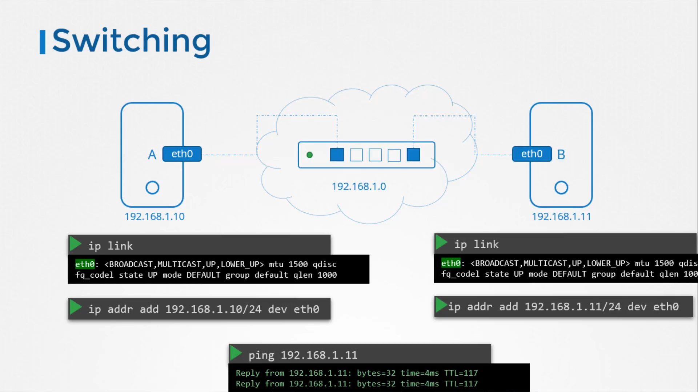

# Switch 
1. Enables connectivity within a single network (home, small office )



# Router 
1. Connectes between two different network 
2. It has two unique ids in 2 different networks 

# Gateway 


# Networking related Commands
### Check the ip adress 
```
ip addr
```

### To see the network interface for the host 
```
ip link
````
